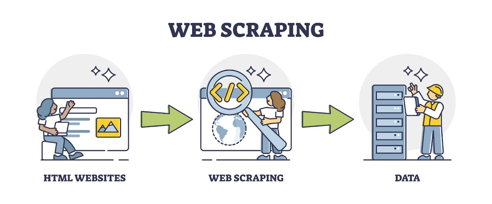

<h3 align="center">🎉 Web Scrape Jobs with Python - Extract Job Information to CSV or JSON</h3>

---

Scrape jobs on recruitment website that match expected salaries, with pagination, extract job titles, salary, link, company and summaries from the site and save as a csv file for excel.

#### 🎈 Recruitment Website Involved
1. Indeed 
2. JobsDB

---

### 🔩 Scrape Tools - Beautiful Soup
Beautiful Soup is a Python library that is used for web scraping purposes to pull the data out of HTML and XML files. It creates a parse tree from page source code that can be used to extract data in a hierarchical and more readable manner.

---

### 📢 Sample Display CSV 
